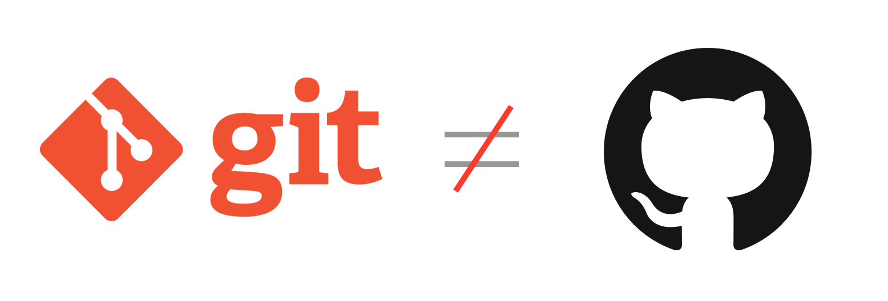

# O que é versionamento de código?

Versionamento de código é a técnica que provê o gerenciamento de alterações em
arquivos, visto que em casos reais onde um indivíduo possa trabalhar em um
projeto com um grupo de pessoas, ambos possam alterar os mesmos arquivos sem
temerem conflitos ou sobrescrita dos mesmos.

# O que é GIT?

Criada por Linus Torvalds em 2005, git é um sistema de controle de versão
distribuído que como o nome já diz, proporciona o versionamento de qualquer
tipo de arquivo, gerando 

# GIT não é GitHub!

Enquanto o git proporciona uma gama de ferramentas para versionar qualquer tipo
de arquivo independente da complexidade de seu contexto, o github provê um
espaço em nuvem onde possa centralizar os códigos/repositórios sem a perca dos
versionamentos existentes, facilitando assim o trabalho colaborativo, visto que
o projeto principal fica disponível em um ambiente comum.
